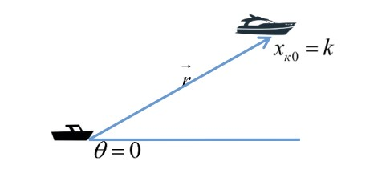
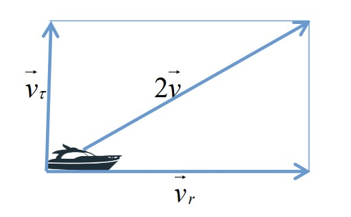
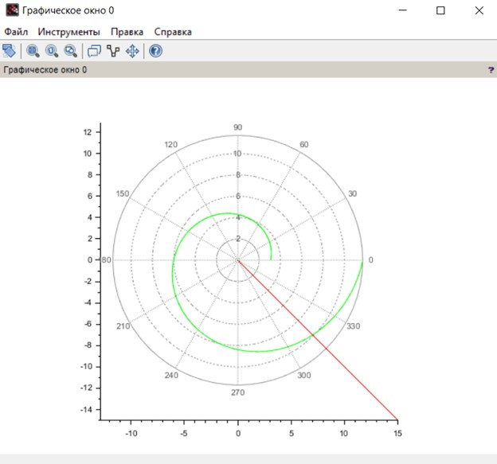
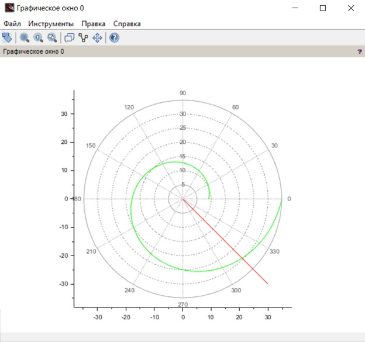
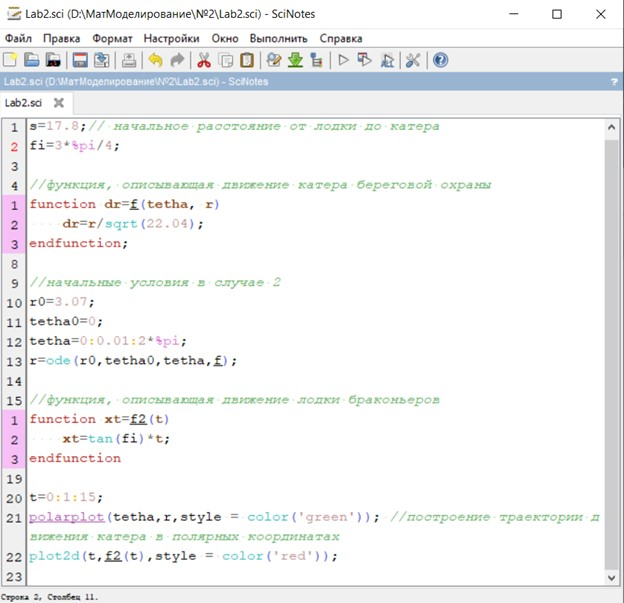
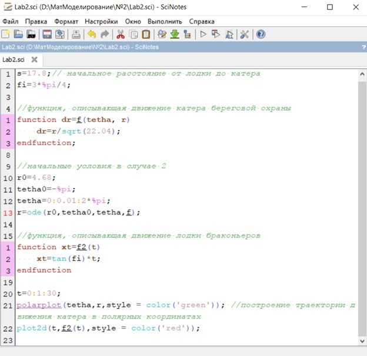

---
## Front matter
title: "Лабораторная работа №2"
subtitle: "Задача о погоне"
author: "Уткина Алина Дмитриевна"

## Generic otions
lang: ru-RU
toc-title: "Содержание"

## Bibliography
bibliography: bib/cite.bib
csl: pandoc/csl/gost-r-7-0-5-2008-numeric.csl

## Pdf output format
toc: true # Table of contents
toc-depth: 2
lof: true # List of figures
fontsize: 12pt
linestretch: 1.5
papersize: a4
documentclass: scrreprt
## I18n polyglossia
polyglossia-lang:
  name: russian
  options:
	- spelling=modern
	- babelshorthands=true
polyglossia-otherlangs:
  name: english
## I18n babel
babel-lang: russian
babel-otherlangs: english
## Fonts
mainfont: IBM Plex Serif
romanfont: IBM Plex Serif
sansfont: IBM Plex Sans
monofont: IBM Plex Mono
mathfont: STIX Two Math
mainfontoptions: Ligatures=Common,Ligatures=TeX,Scale=0.94
romanfontoptions: Ligatures=Common,Ligatures=TeX,Scale=0.94
sansfontoptions: Ligatures=Common,Ligatures=TeX,Scale=MatchLowercase,Scale=0.94
monofontoptions: Scale=MatchLowercase,Scale=0.94,FakeStretch=0.9
mathfontoptions:
## Biblatex
biblatex: true
biblio-style: "gost-numeric"
biblatexoptions:
  - parentracker=true
  - backend=biber
  - hyperref=auto
  - language=auto
  - autolang=other*
  - citestyle=gost-numeric
## Pandoc-crossref LaTeX customization
figureTitle: "Рис."
tableTitle: "Таблица"
listingTitle: "Листинг"
lofTitle: "Список иллюстраций"
lotTitle: "Список таблиц"
lolTitle: "Листинги"
## Misc options
indent: true
header-includes:
  - \usepackage{indentfirst}
  - \usepackage{float} # keep figures where there are in the text
  - \floatplacement{figure}{H} # keep figures where there are in the text
  - \usepackage{amsmath}
  - \usepackage{amssymb}
  - \usepackage{mathtools}
---

# Цель работы

Целью данной работы является построение математической модели для выбора правильной стратегии при решении задач поиска. 

# Задание

Вариант 55 (1132226534%70 + 1 = 55)

На море в тумане катер береговой охраны преследует лодку браконьеров. Через определенный промежуток времени туман рассеивается, и лодка обнаруживается на расстоянии 17,8 км от катера. Затем лодка снова скрывается в тумане и уходит прямолинейно в неизвестном направлении. Известно, что скорость катера в 4,8 раза больше скорости браконьерской лодки. 

1. Провести аналогичные рассуждения и вывод дифференциальных уравнений, если скорость катера больше скорости лодки в n раз (значение n задайте самостоятельно) 
2. Постройте траекторию движения катера и лодки для двух случаев. 
3. Найдите точку пересечения траектории катера и лодки

# Теоретическое введение

1. Принимаем за t0 = 0, xл0 = 0 - место нахождения лодки браконьеров в момент обнаружения, xк0 = k - место нахождения катера береговой охраны относительно лодки браконьеров в момент обнаружения лодки.

2. Введем полярные координаты. Считаем, что полюс - это точка обнаружения лодки браконьеров xл0 (xл0 = 0), а полярная ось r проходит через точку нахождения катера береговой охраны (рис. [-@fig:001]).

{#fig:001 width=70%}

3. Траектория катера должна быть такой, чтобы и катер, и лодка все время были на одном расстоянии от полюса, только в этом случае траектория катера пересечется с траекторией лодки. Поэтому для начала катер береговой охраны должен двигаться некоторое время прямолинейно, пока не окажется на том же расстоянии от полюса, что и лодка браконьеров. После этого катер береговой охраны должен двигаться вокруг полюса удаляясь от него с той же скоростью, что и лодка браконьеров.

4. Чтобы найти расстояние x (расстояние после которого катер начнет двигаться вокруг полюса), необходимо составить простое уравнение. Пусть через время t катер и лодка окажутся на одном расстоянии x от полюса. За это время лодка пройдет x, а катер k-x (или k+x, в зависимости от начального положения катера относительно полюса). Время, за которое они пройдут это расстояние, вычисляется как x/v или (k-x)/2v (во втором случае (x+k)/2v). Так как время одно и то же, то эти величины одинаковы.

5. После того, как катер береговой охраны окажется на одном расстоянии от полюса, что и лодка, он должен сменить прямолинейную траекторию и начать двигаться вокруг полюса удаляясь от него со скоростью лодки v. Для этого скорость катера раскладываем на две составляющие: vr - радиальная скорость и vt - тангенциальная скорость (рис. [-@fig:002]). Радиальная скорость - это скорость, с которой катер удаляется от полюса. Нам нужно, чтобы эта скорость была равна скорости лодки. Тангенциальная скорость – это линейная скорость вращения катера относительно полюса. Она равна произведению угловой скорости на радиус r.

{#fig:002 width=70%}

6. Решение исходной задачи сводится к решению системы из двух дифференциальных уравнений с различными начальными условиями. Исключая из полученной системы производную по t, можно перейти к уравнению, решив которое, вы получите траекторию движения катера в полярных координатах.

# Выполнение лабораторной работы

Принимаем за t0 = 0 , xл0 = 17.8 - место нахождения лодки браконьеров в момент обнаружения, xк0 = k - место нахождения катера береговой охраны относительно лодки браконьеров в момент обнаружения лодки.

Чтобы найти расстояние (расстояние после которого катер начнет двигаться вокруг полюса), необходимо составить простое уравнение. 

Пусть через время t катер и лодка окажутся на одном расстоянии x от полюса. За это время лодка пройдет x, а катер 17,8–x (или 17,8+x, в зависимости от начального положения катера относительно полюса). 
Время, за которое они пройдут это расстояние, вычисляется как

$$
t = \frac{x}{v}
$$

или 

$$
t=\frac{17,8-x}{4,8v}
$$

и во втором случае 

$$
t=\frac{17,8+x}{4,8v}
$$

Так как время одно и то же, то эти величины одинаковы. Тогда неизвестное расстояние можно найти из следующего уравнения: 

$$
\frac{x}{v}=\frac{17,8-x}{4,8v}
$$

в первом случае и 

$$
\frac{x}{v}=\frac{17,8+x}{4,8v}
$$

во втором.
Найдем два значения для x:

$$
x_1=3,07
$$
$$
x_2=4,68
$$

После того, как катер береговой охраны окажется на одном расстоянии от полюса, что и лодка, он должен сменить прямолинейную траекторию и начать двигаться вокруг полюса удаляясь от него со скоростью лодки . v 
Для этого скорость катера раскладываем на две составляющие: vr - радиальная скорость и vt - тангенциальная скорость.
Радиальная скорость - это скорость, с которой катер удаляется от полюса, нам нужно, чтобы эта скорость была равна скорости лодки.

$$
v_r=\frac{dr}{dt}=v
$$

Тангенциальная скорость – это линейная скорость вращения катера относительно полюса. Она равна произведению угловой скорости на радиус.

$$
v_t=\sqrt{\left(4,8v\right)^2-v^2}=\sqrt{22,04}v=r\frac{d\theta}{dt}
$$

Решение исходной задачи сводится к решению системы из двух дифференциальных уравнений 

$$
\frac{dr}{dt}=v
$$
$$
r\frac{d\theta}{dt}=\sqrt{22,04}v
$$

с начальными условиями 

$$
\theta_0=0
$$
$$
r_0=x_1=3,07
$$

(рис. [-@fig:003]) или 

$$
\theta_0=-\pi
$$
$$
r_0=x_2=4,68
$$

(рис. [-@fig:005]).

Исключая из полученной системы производную по t, можно перейти к следующему уравнению:
$$
\frac{dr}{d\theta}=\frac{r}{\sqrt{22,04}}
$$

{#fig:003 width=70%}

{#fig:005 width=70%}

Код программы для графиков представлен на (рис. [-@fig:004]) и рис. [-@fig:006]) соответственно.

{#fig:004 width=70%}

{#fig:006 width=70%}

# Выводы

В ходе лабораторной работы была рассмотрена математическая модель задачи о погоне и построены графики для нахождения решения данной задачи.

# Список литературы{.unnumbered}

::: {#refs}
:::
